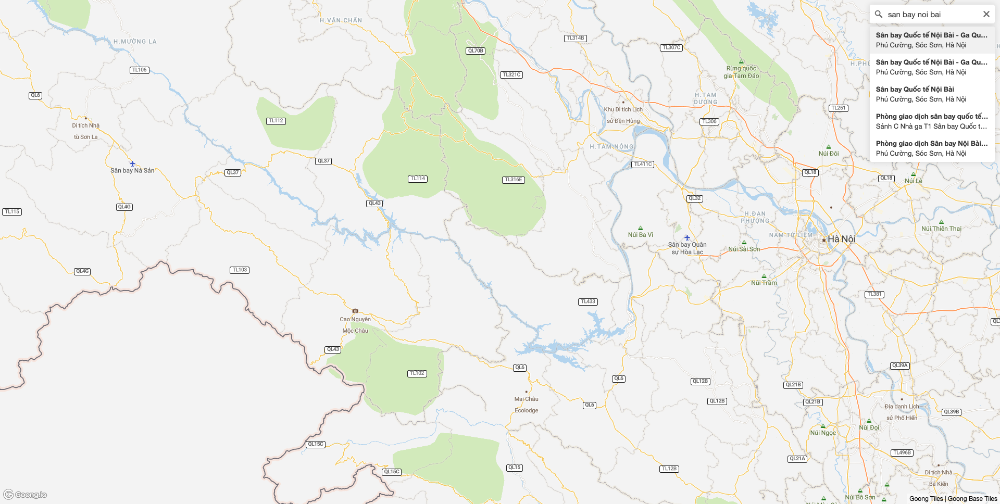

# @goongmaps/goong-geocoder-reat

React wrapper for `@goongmaps/goong-geocoder` for use with `@goongmaps/goong-map-react`

[](https://www.npmjs.com/package/@goongmaps/goong-geocoder-react)


## Demo
https://codesandbox.io/s/goong-geocoder-react-example-0grf7

## Installation
NPM
```
$ npm install @goongmaps/goong-geocoder-react
```

or

Yarn
```
$ yarn add @goongmaps/goong-geocoder-react
```

## Styling
Import:
```js
import '@goongmaps/goong-geocoder-react/dist/goong-geocoder.css'
```

or

Link tag in header:
```html
<link href='https://unpkg.com/@goongmaps/goong-geocoder@1.0.5/dist/goong-geocoder.css' rel='stylesheet' />
```


## Props
Only `mapRef` and `goongApiAccessToken` are required.

| Name | Type | Default | Description |
|--- | --- | --- | --- |
| mapRef | Object | | Ref for react-map-gl map component.
| containerRef | Object | | This can be used to place the geocoder outside of the map. The `position` prop is ignored if this is passed in.
| onViewportChange | Function | () => {} | Is passed updated viewport values after executing a query.
| goongApiAccessToken | String | | https://account.goong.io
| inputValue | String | | Sets the search input value
| origin | String | "https://rsapi.goong.io" | Use to set a custom API origin.
| zoom | Number | 14 | On geocoded result what zoom level should the map animate to
| radius | Number | 3000 | Distance by kilometers around map center
| placeholder | String | "Search" | Override the default placeholder attribute value.
| proximity | Object | | A proximity argument: this is a geographical point given as an object with latitude and longitude properties. Search results closer to this point will be given higher priority.
| trackProximity | Boolean | false | If true, the geocoder proximity will automatically update based on the map view.
| collapsed | Boolean | false | If true, the geocoder control will collapse until hovered or in focus.
| clearAndBlurOnEsc | Boolean | false | If true, the geocoder control will clear it's contents and blur when user presses the escape key.
| clearOnBlur | Boolean | false | If true, the geocoder control will clear its value when the input blurs.
| minLength | Number | 2 | Minimum number of characters to enter before results are shown.
| limit | Number | 5 | Maximum number of results to show.
| render | Function | | A function that specifies how the results should be rendered in the dropdown menu. Accepts a single Carmen GeoJSON object as input and return a string. Any html in the returned string will be rendered. Uses goong-geocoder's default rendering if no function provided.  
| position | String | "top-right" | Position on the map to which the geocoder control will be added. Valid values are `"top-left"`, `"top-right"`, `"bottom-left"`, and `"bottom-right"`.
| onInit | Function | () => {} | Is passed Goong geocoder instance as param and is executed after Goong geocoder is initialized.
| onClear | Function | () => {} | Executed when the input is cleared.
| onLoading | Function | () => {} | Is passed `{ query }` as a param and is executed when the geocoder is looking up a query.
| onResults | Function | () => {} | Is passed `{ results }` as a param and is executed when the geocoder returns a response.
| onResult | Function | () => {} | Is passed `{ result }` as a param and is executed when the geocoder input is set.
| onError | Function | () => {} | Is passed `{ error }` as a param and is executed when an error occurs with the geocoder.
  
  
  
## Example
```js
import '@goongmaps/goong-js/dist/goong-js.css'
import '@goongmaps/goong-geocoder/dist/goong-geocoder.css'
import React, { Component } from 'react'
import MapGL from '@goongmaps/goong-map-react'
import Geocoder from '@goongmaps/goong-geocoder-react'

class Example extends Component {
  state = {
    viewport: {
      latitude: 21.026975,
      longitude: 105.853460,
      zoom: 12
    }
  }

  mapRef = React.createRef()

  handleViewportChange = (viewport) => {
    this.setState({
      viewport: { ...this.state.viewport, ...viewport }
    })
  }

  // if you are happy with Geocoder default settings, you can just use handleViewportChange directly
  handleGeocoderViewportChange = (viewport) => {
    const geocoderDefaultOverrides = { transitionDuration: 1000 }

    return this.handleViewportChange({
      ...viewport,
      ...geocoderDefaultOverrides
    })
  }

  render() {
    return (
      <MapGL
        ref={this.mapRef}
        {...this.state.viewport}
        width="100%"
        height="100%"
        onViewportChange={this.handleViewportChange}
        goongApiAccessToken='YOUR_MAPTILES_KEY'>
        <Geocoder
          mapRef={this.mapRef}
          onViewportChange={this.handleGeocoderViewportChange}
          goongApiAccessToken='YOUR_API_KEY'
        />
      </MapGL>
    )
  }
}

export default Example

```


